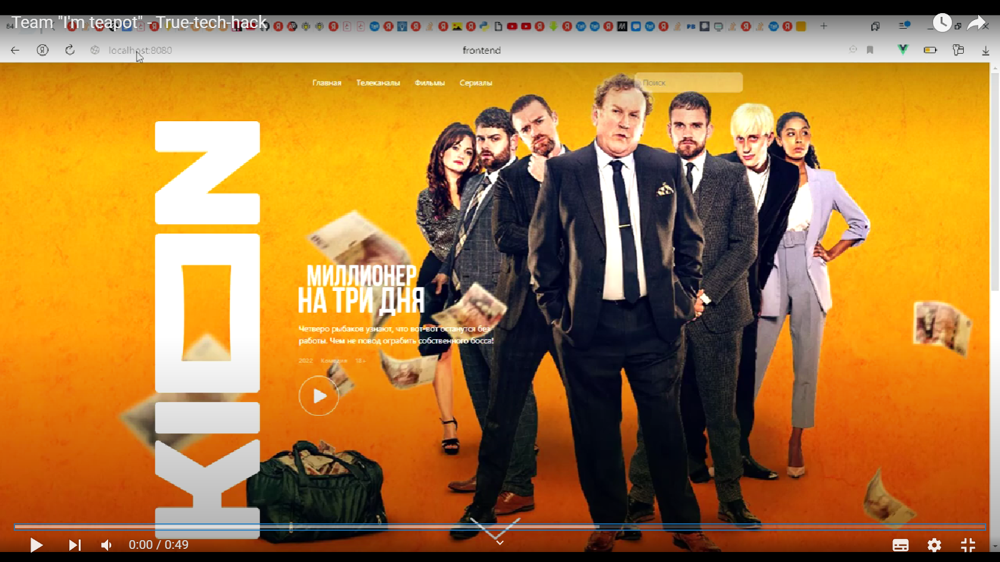

# Адаптация фильмов для людей с особыми потребностями
Проект на хакатон banner
True Tech Hack

Команда: **I'm a teapot**

## Демо:
=
[](https://youtu.be/pJ4CKSHOHFk;)

## Оглавление
0. [Команда](#Команда)
1. [Задача](#Задача)
2. [Архитектура](#Архитектура)
3. [Описание Backend](#Описание-Backend)
4. [Описание Frontend](#Описание-Frontend)
5. [Развёртывание решения](#Развёртывание-решения)
6. [Описание структуры папок проекта](#Описание-структуры-папок-проекта)
7. [Запуск](#Запуск)

## Команда
1. [Дмитрий Борисов](https://t.me/DmitriiBorisov) - backend/frontend
2. [Мария Бахвалова](https://t.me/maria_bakhvalova) - UX/UI дизайнер
3. [Алексей](https://t.me/lesha271) - frontend
4. [Юрий](https://t.me/uikola) - backend

[:arrow_up:Оглавление](#Оглавление)

## Задача
### Описание задачи
Необходимо разработать дополнительный функционал для плеера KION, который поможет пользователям с особыми потребностями комфортно смотреть любимые фильмы и сериалы. Например, настраивать яркость и контрастность изображения, цветовую палитру и удалять сцены, которые могут вызвать эпилептический припадок

[:arrow_up:Оглавление](#Оглавление)

## Архитектура
    python 3.8
    backend - FastApi
    forntend - vue.js

[:arrow_up:Оглавление](#Оглавление)

## Описание Backend

Backend, реализованный на `FastApi`, находится в папке `backend`.

[:arrow_up:Оглавление](#Оглавление)

## Описание Frontend

Нами был использован `framefork` `vue.js` для создания приложения.

[:arrow_up:Оглавление](#Оглавление)

## Развёртывание решения

Для удобства запуска приложения на разных платформах был использован `docker`. В папке `frontend` есть `dockerfile` который описывает состояние контейнера. Созданный контейнер будет оптравлен и развернут на удаленном сервере

### 1. Установка Docker (Ubuntu 20.04) 
https://www.digitalocean.com/community/tutorials/how-to-install-and-use-docker-on-ubuntu-20-04-ru

    sudo apt update
    sudo apt install apt-transport-https ca-certificates curl software-properties-common
    curl -fsSL https://download.docker.com/linux/ubuntu/gpg | sudo apt-key add -
    sudo add-apt-repository "deb [arch=amd64] https://download.docker.com/linux/ubuntu focal stable"
    sudo apt update
    apt-cache policy docker-ce
    sudo apt install docker-ce
    sudo systemctl status docker // status

### 2. Установка Docker-compose (Ubuntu 20.04)
https://www.digitalocean.com/community/tutorials/how-to-install-and-use-docker-compose-on-ubuntu-20-04-ru

    sudo curl -L "https://github.com/docker/compose/releases/download/1.26.0/docker-compose-$(uname -s)-$(uname -m)" -o /usr/local/bin/docker-compose
    sudo chmod +x /usr/local/bin/docker-compose
    docker-compose --version // status


### 3. Запуск через Docker-compose
https://webdevblog.ru/kak-ispolzovat-django-postgresql-i-docker/

    git clone https://github.com/bd240897/true-tech-hack
    cd kaspersky-hack/
    docker-compose -f docker-compose.back.yml up --build -d 
    docker-compose -f docker-compose.front-nginx.yml up --build -d 
    
[:arrow_up:Оглавление](#Оглавление)

## Описание структуры папок проекта

Размеченные шаблоны страниц для нашего приложения находятся в папке `templates`.
В задании был использован `bootstrap` framework

- **backend** - Файлы для бэкенда (fastapi)
  - main - основная логика проекта
  - requirements - зависимости
- **frontend** - Файлы для фронтенда (vue)
  - public - Общедоступные файлы
  - src - исходники
- **html_templates** - сверстанные шаблоны

[:arrow_up:Оглавление](#Оглавление)

## Запуск
Протестировать уже запущенный сайт можно по ссылке:</br>

    http://91.185.84.82:8080/ (доступен на момент предоставления решения)
    # или
    http://localhost:8080/ (доступен при создании локального проекта)

[:arrow_up:Оглавление](#Оглавление)

## Заметки
```
Оформление гитхаба
https://github.com/GnuriaN/format-README#Оглавление
```
